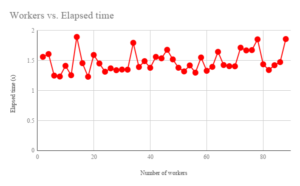
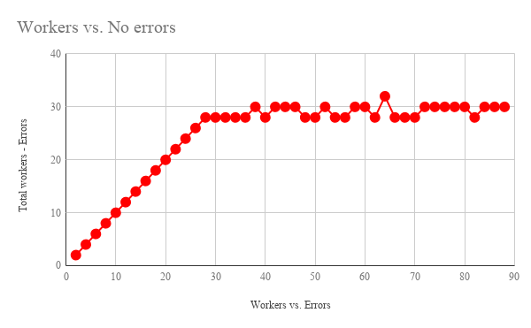

# RunAll

<a name="top"></a>
[](LICENCE)

<a name="overview"></a>

# Overview

**This is a library for running the concurrent processing using only native Google Apps Script (GAS).**

<a name="description"></a>

# Description

Have you ever thought about the concurrent processing using only native Google Apps Script (GAS)? So far, I had run the concurrent processing using golang, javascript and python. But the script cannot be used by the trigger event, because these are not native GAS. Recently, it was found that [the fetchAll method](<https://developers.google.com/apps-script/reference/url-fetch/url-fetch-app#fetchAll(Object)>) added by the Google's update at January 19, 2018 is [worked by the asynchronous processing](https://gist.github.com/tanaikech/c0f383034045ab63c19604139ecb0728). By this, the concurrent processing using the native GAS got to be able to be achieved. This library makes users work the concurrent processing of functions using the fetchAll method, the execution API and Web Apps. This can drastically reduce the process cost in the script. And also this can be used under the trigger event. So it is considered that it will be useful for both the limit executing time of 6 minutes for GAS and the limit total executing time of 90 minutes/day for the trigger event.

# Library's project key

```
1FWYhQFhL7UIAZJn-FR3TlcHvXwHPJc2HwI4vtmNUAQv2OybGe-S97Lal
```

# Methods:

This library is largely separated in to 2 methods.

1. [Parallel processing with the method of scripts.run of Google Apps Script API](#useappsscriptapi).

2. [Parallel processing with Web Apps.](#usewebapps) <sup><font color="Red">New</font></sup>
   - In this case, the method for providing script for `doPost()` is used.

<a name="useappsscriptapi"></a>

# 1. Parallel processing with the method of scripts.run of Google Apps Script API

<a name="howtoinstall"></a>

## How to install

<a name="BasicSettingFlow"></a>

### Before installing this library

**IMPORTANT: Please check this.**

At April 8, 2019, the specification of Google Apps Script Project was changed. By this, when new GAS project is created after April 8, 2019, in order to use Google API (Google Apps Script API and Drive API which can be used by ggsrun.), the GAS project is required to link to Cloud Platform Project. When you use the GAS project created after April 8, 2019, at first, **please do [this flow](https://gist.github.com/tanaikech/e945c10917fac34a9d5d58cad768832c)**.

After the GAS project was linked to Cloud Platform Project by above flow, please do "Basic setting flow" at the next section.

- [Ref1: Default Cloud Platform projects](https://developers.google.com/apps-script/guides/cloud-platform-projects#default_cloud_platform_projects)
- [Ref2: Linking Cloud Platform Project to Google Apps Script Project](https://gist.github.com/tanaikech/e945c10917fac34a9d5d58cad768832c)

### Install this library

In order to use this library, please install this library, deploy API executable and enable Apps Script API. You can see the flow of them as follows.

1. Prepare a project.
   - Create new project and please do the following flow at this project.
   - If you want to use this library at the existing project, please do the following flow at the existing project.
   - You can use this library for both the standalone type and the container-bound script type.
1. [Install RunAll library](https://developers.google.com/apps-script/guides/libraries).
   - Library's project key is **`1FWYhQFhL7UIAZJn-FR3TlcHvXwHPJc2HwI4vtmNUAQv2OybGe-S97Lal`**.
1. [Deploy API executable](https://developers.google.com/apps-script/api/how-tos/execute#step_1_deploy_the_script_as_an_api_executable).
   1. On script editor
      - "Publish" -> "Deploy as API executable"
      - Input version for "version" as NEW.
      - Select "Only myself" for Who has access to the script".
      - Click "Deploy".
      - Click "Continue".
      - Click "Close"
1. Enable Apps Script API.
   1. On the Script Editor
      - Resources -> Cloud Platform Project
      - Click "View API Console"
   1. On "DASHBOARD"
      - In "Getting Started", Click "Enable APIs and get credentials like keys".
      - Click "Library" at left side.
      - At "Search APIs and services", Input "**apps script**", Click it.
      - Select "Apps Script API"
      - **Enable "Google Apps Script API"**
1. **Also here [https://script.google.com/home/usersettings](https://script.google.com/home/usersettings) has to be enabled. Please turn ON.**

> **IMPORTANT!**

> **<u>After installed the library, please push the save button at the script editor.</u>** This is very important! By this, the library is completely reflected.

> Even if the apps script API is enabled and API executable is deployed. when the following error is returned, please push the save button at the script editor.
> `{"error": {"code": 404, "message": "Requested entity was not found.", "status": "NOT_FOUND"}}`

### How to enable Apps Script API directly

If you know project ID of the script that you use, you can directly access to the page to enable API using your browser.

- For Apps Script API
  - `https://console.cloud.google.com/apis/library/script.googleapis.com/?project=### project ID ###`

### About scopes

About the install of scopes used at this library, users are not required to install scopes. Because this library can automatically install the required scopes to the project which installed this library. The detail information about this can be seen at [here](https://gist.github.com/tanaikech/23ddf599a4155b66f1029978bba8153b).

The following scopes are installed in this library.

- `https://www.googleapis.com/auth/drive.readonly`
- `https://www.googleapis.com/auth/script.external_request`

## Usage

A sample script is as follows. This sample script runs 2 works for `myFunction()`. The functions to use at Apps Script API are put in the same project with the project installed this library. When you use this sample script, at first, please carry out the above [installation flow](#howtoinstall).

```javascript
function myFunction(e) {
  Utilities.sleep(1000);
  return e;
}

function main() {
  // Please set "workers.length < 30".
  var workers = [
    {
      functionName: "myFunction",
      arguments: ["request1"]
    },
    {
      functionName: "myFunction",
      arguments: ["request2"]
    }
  ];
  var results = RunAll.Do(workers); // Using this library
  Logger.log(results);
}
```

When the installation is fine, you can see the following result.

```
[
  {
    "done": true,
    "response": {
      "@type": "type.googleapis.com/google.apps.script.v1.ExecutionResponse",
      "result": "request1"
    }
  },
  {
    "done": true,
    "response": {
      "@type": "type.googleapis.com/google.apps.script.v1.ExecutionResponse",
      "result": "request2"
    }
  }
]
```

- In this sample, when `main()` is run, the script is launched.
  - `myFunction()` is used by Apps Script API.
- Object of workers is constructed by JSON array with the keys of `functionName` and `arguments`.
  - "functionName" is the function name for running by this library.
  - "arguments" is the arguments giving to the function which is used for running.
  - Please set `workers.length < 30`.
- "results" retrieved by `RunAll.Do(workers)` is the same to that retrieved by the fetchAll method. So each result for the each request is in "results" which is the 1 dimensional array.
  - The data retrieved by the fetchAll is [Class HTTPResponse](https://developers.google.com/apps-script/reference/url-fetch/http-response) for each element. So you can use each method for Class HTTPResponse like `getContentText()`, `getResponseCode()` and so on.
  - The each element of the result array is from [Method: scripts.run](https://developers.google.com/apps-script/api/reference/rest/v1/scripts/run).

<a name="usewebapps"></a>

# 2. Parallel processing with Web Apps

In this method, the parallel processing is achieved with Web Apps. The flow is almost the same with above method. The deployed Web Apps is accessed using the fetchAll method. I think that the installation for using Apps Script API is a bit complicate. And I thought that this is making users difficult to use Apps Script API. As one of workarounds for making easy to run the directly specified functions in the project, I used Web Apps. In this method, the parallel process of Google Apps Script can be achieved by Web Apps.

## How to install

### 1. Create new project

Please create new project. In this case, you can use both the standalone script type and the container-bound script type. Here, as a sample case, the standalone script type is used. In order to create new standalone project, please access to [https://script.google.com](https://script.google.com), and click "New script". By this, the script editor is opened as new project. Then please give the project name. By this, new standalone project is created.

### 2. Install this library

1. [Install RunAll library](https://developers.google.com/apps-script/guides/libraries).
   - Library's project key is **`1FWYhQFhL7UIAZJn-FR3TlcHvXwHPJc2HwI4vtmNUAQv2OybGe-S97Lal`**.

### 3. Deploy Web Apps

1. On the script editor, Open a dialog box by "Publish" -> "Deploy as web app".
2. Select **"User accessing the web app"** or **"Me"** for "Execute the app as:".
3. Select **"Only myself"** for "Who has access to the app:".
   - By this setting, Web Apps can be accessed by only you who are the owner. If "Anyone, even anonymous" is set, all people who know the URL of Web Apps can be accessed. So please be careful.
4. Click "Deploy" button as new "Project version".
5. Automatically open a dialog box of "Authorization required".
   1. Click "Review Permissions".
   2. Select own account.
   3. Click "Advanced" at "This app isn't verified".
   4. Click "Go to ### project name ###(unsafe)"
   5. Click "Allow" button.
6. Copy the URL of "latest code" of "Test web app for your latest code.".
   - It's like `https://script.google.com/macros/s/###/dev`.
7. Click "OK".

- By this, even when the script in the project deployed Web Apps was modified, the latest script can be automatically used.
- In this setting, the deployed Web Apps in the project is accessed from the script in the same project.

### 4. Copy and paste script for Web Apps

Please copy and paste the following script to the created project on the script editor for using with Web Apps. In this sample script, `myFunction()` is run 3 times.

```javascript
function myFunction(e) {
  Utilities.sleep(1000);
  return e;
}

function doPost(e) {
  return RunAll.RunFunctionsByDoPost(this, e);
}

function main() {
  var url = "https://script.google.com/macros/s/###/dev"; // Here, please set the URL of Web Apps.
  var token = ScriptApp.getOAuthToken();
  var resource = [
    {
      functionName: "myFunction",
      arguments: "sample parameter 1",
      webAppsURL: url,
      accessToken: token
    },
    {
      functionName: "myFunction",
      arguments: "sample parameter 2",
      webAppsURL: url,
      accessToken: token
    },
    {
      functionName: "myFunction",
      arguments: "sample parameter 3",
      webAppsURL: url,
      accessToken: token
    }
  ];
  var res = RunAll.DoWebApps(resource);
  res.forEach(function(r) {
    Logger.log(r.getContentText());
  });
}
```

When `main()` of above script is run, the following result is retrieved by parallel processing.

```json
{"FunctionName":"myFunction","Arguments":"sample parameter 1","Result":"sample parameter 1"}

{"FunctionName":"myFunction","Arguments":"sample parameter 2","Result":"sample parameter 2"}

{"FunctionName":"myFunction","Arguments":"sample parameter 3","Result":"sample parameter 3"}

```

- The average process time of `RunAll.DoWebApps(resource)` was about 1.6 seconds. By this, it is found that 3 functions are run with the asynchronous process.

- **When you use this method, please use the values of the string type to the arguments and returned values for the function you want to run. This is due to the specification of Web Apps. Please be careful this.**

# Limitation of workers

When a function is run by Apps Script API and Web Apps, it is considered that there is the limitation for the number of simultaneous connections. Here, it was measured. For Web Apps, you can see it at [here](https://github.com/tanaikech/taking-advantage-of-Web-Apps-with-google-apps-script#limitationofsimultaneousconnection) and [here](https://stackoverflow.com/a/50033976).

<br>



Fig. 1: Number of workers vs. elapsed time. At the function for working, `Utilities.sleep(1000)` is used. So the data points are existing near 1 s.

<br>



Fig. 2: Number of workers vs. number of workers without errors. Horizontal axis is the number of workers. Vertical axis is the number of workers which subtracted the number of errors from the total workers, when the results were returned.

<br>

Figure 1 is the typical result for the number of workers vs. elapsed time. From Fig. 1, the elapsed time is almost no change with the increase in the number of workers. At the function for working, `Utilities.sleep(1000)` is used. This indicates that RunAll is working with the concurrent processing. Figure 2 is the typical result for the number of workers vs. number of workers without errors. Figure 2 indicates that when the number of workers is more than 30, the number of living workers is almost the constant of about 30. All other workers have errors as follows.

```
{
  "done": true,
  "error": {
    "code": 3,
    "message": "ScriptError",
    "details": [
      {
        "@type": "type.googleapis.com/google.apps.script.v1.ExecutionError",
        "errorMessage": "Service invoked too many times in a short time: exec qps. Try Utilities.sleep(1000) between calls.",
        "errorType": "ScriptError"
      }
    ]
  }
}
```

These results indicate that the number of workers is required to be under 30. For above sample script, the length of workers has to be under 30. If the number of workers is more than 30, the error is included in the returned results. Also this means that the limitation of number of simultaneous connections for Apps Script API is 30. It could be also confirmed that this result was the same to Web Apps. As the result, in the current stage, it was found that the concurrent processing using native GAS can be achieved. And when you use this library, please set `workers.length < 30`.

# Future

[It has already known that the limitation of number of requests for the fetchAll method is more than 1000.](https://gist.github.com/tanaikech/c0f383034045ab63c19604139ecb0728) So if the several servers of Apps Script API and Web Apps are used for this situation and furthermore such clients are aggregated as a system, it is considered that the concurrent processing with the high spec using native GAS can be produced. As more update of this library, I would like to try to create such system.

# Appendix

- [Benchmark: fetchAll method in UrlFetch service for Google Apps Script](https://gist.github.com/tanaikech/c0f383034045ab63c19604139ecb0728)

# Acknowledgement

- [Adam Morris](https://github.com/brainysmurf)

---

<a name="licence"></a>

# Licence

[MIT](LICENCE)

<a name="author"></a>

# Author

[Tanaike](https://tanaikech.github.io/about/)

If you have any questions and commissions for me, feel free to tell me.

<a name="updatehistory"></a>

# Update History

- v1.0.0 (April 24, 2018)

  1. Initial release.

- v1.1.0 (August 26, 2018)

  1. [New method for achieving the parallel processing with Web Apps was added.](#usewebapps)

[TOP](#top)
